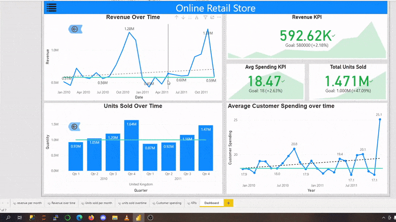

# Online Retail KPI dashboard 

In this project i worked at a kpi dash board showcasing different key performance indicators 
for the retail store while providing an app like experience for the stakeholders. 
## KPIs
- Revenue per Quarter
- Average Customer Spending 
- Units Sold

### Different skills used in this viz 

- Bookmarks
- Slicers 
- Conditional Drilling down
- Buttons

##  Demo 

